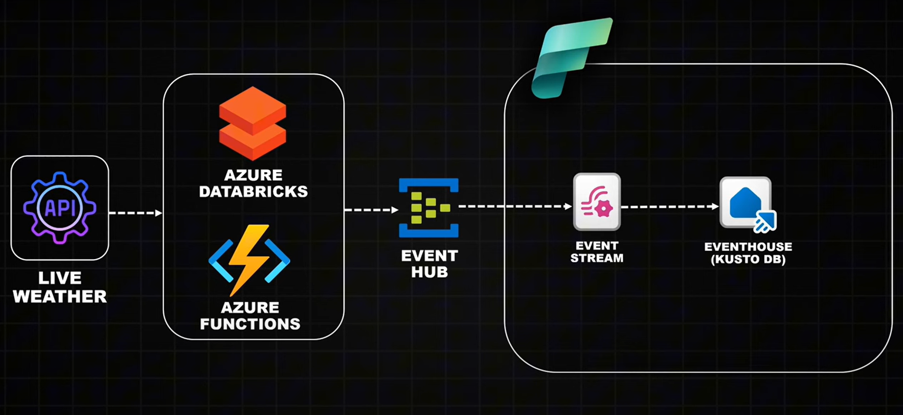

# Real-Time Weather Data Streaming on Azure

This repository implements an end-to-end, cloud-native data engineering solution for real-time weather monitoring. It uses Azure resources for streaming, analytics, visualization, and alerting.

---

## Key Components

- **Weather API** (external source)
- **Azure Databricks & Azure Functions** – ingest and stream data
- **Azure Event Hub** – scalable, real-time event messaging
- **Microsoft Fabric** – stream and transform events (Event Stream, Eventhouse)
- **Azure Data Explorer (ADX)** – fast, scalable time-series analytics (using KQL)
- **Power BI** – reporting and dashboards
- **Azure Data Activator** – real-time anomaly alerting

---

## Features

- Real-time/near real-time weather data ingestion and processing
- Hands-on code for Databricks (notebook) and Azure Function (Python)
- Kusto DB schema and mapping for streaming storage
- Ready-to-use KQL queries for analytics and alerts
- Visualization using Power BI and ADX Dashboards
- Sensible cost and security practices

---

## 🏗Solution Architecture

---

